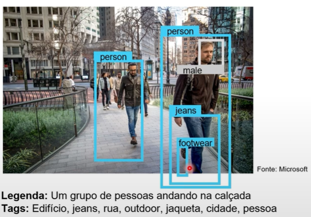

# Análise de Imagem 4.0 com o Serviço de Visão de IA

Os recursos avançados de análise de imagem oferecem uma gama de funcionalidades para diversas necessidades:

- **Personalização do Modelo:** Ajustar o modelo de acordo com as especificações do seu projeto.
- **Leitura de Texto em Imagens:** Extrair texto de imagens, seja impresso ou escrito à mão.
- **Detecção de Pessoas em Imagens:** Identificar a presença de pessoas em suas imagens.
- **Geração de Legendas de Imagens:** Automatizar a criação de legendas para suas imagens.
- **Detecção de Objetos:** Identificar e classifique objetos presentes nas imagens.
- **Marcação de Recursos Visuais:** Realçar características visuais específicas nas suas imagens.
- **Corte Inteligente:** Recortar automaticamente áreas relevantes das imagens.

## Detecção de Rostos com o Serviço de Reconhecimento Facial

O serviço de reconhecimento facial oferece recursos avançados para identificar características faciais:

- **Desfoque:** Avaliar o nível de desfoque presente nos rostos.
- **Exposição:** Analisar aspectos como ruído e iluminação da imagem.
- **Óculos:** Detectar se a pessoa está usando óculos.
- **Pose da Cabeça:** Determinar a orientação tridimensional do rosto.
- **Ruído e Oclusão:** Identificar ruídos visuais e possíveis obstruções no rosto.

Porém, o acesso aos recursos de reconhecimento facial como a correspondência de similaridade e verificação de identidade é exclusivo para clientes gerenciados da Microsoft.

## Leitura de Texto com Reconhecimento Óptico de Caracteres (OCR)

O sistema é capaz de detectar e extrair texto de imagens, seja ele impresso ou escrito à mão. Oferece opções para extrair texto rapidamente de imagens ou realizar análises assíncronas em documentos digitalizados maiores.

## Serviço de Visão DP

- **Análise de Face:** Utilizar o serviço para analisar características faciais em suas imagens.
- **Análise de Documentos:** Extrair texto de documentos digitalizados de forma rápida e eficiente.
